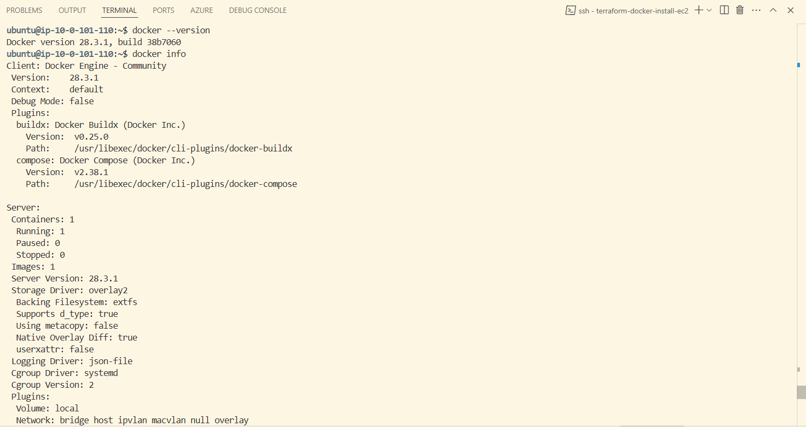
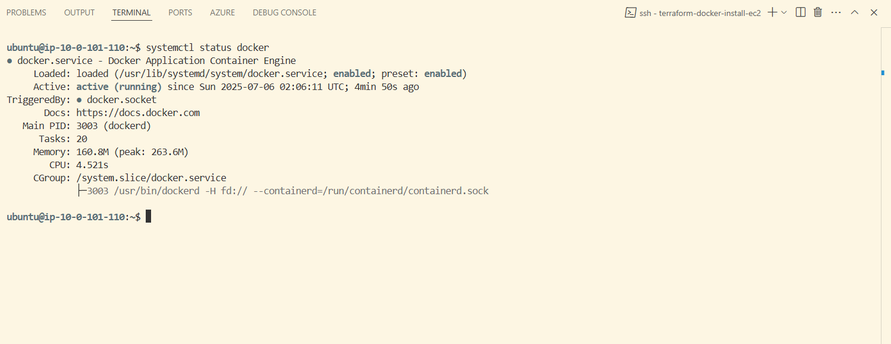

## 🚀 Terraform EC2 Instance with Docker Installation

This project uses Terraform to provision an AWS EC2 instance and automatically installs Docker on it using a user-data shell script.

📦 What This Setup Does
Creates a new EC2 instance in the default VPC.

Uses a user-data script (user-data.sh) to install Docker on instance launch.

Outputs the instance's public IP for SSH access.

🚀 Snapshots

